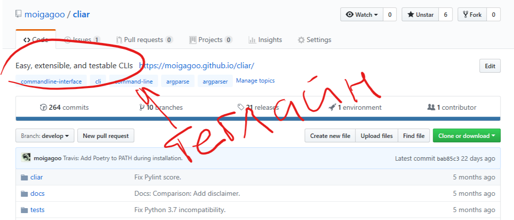
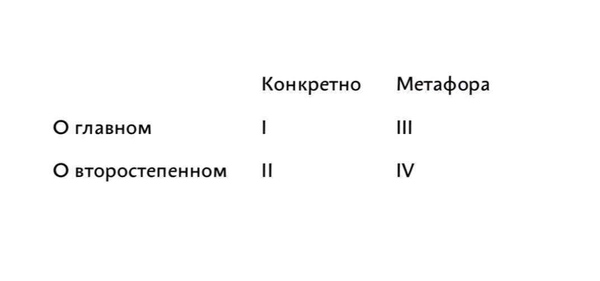

# Структура документа

Разные части документа имеют разный визуальный вес: картинки заметнее текста, крупный текст заметнее мелкого. Глаз бессознательно движется от более заметных элементов к менее заметным. Используя это, мы помогаем читателю находить важную информацию там, где он её ожидает.

Рассмотрим, из чего состоит документ, и в каком порядке расставлять его части.

## Элементы документа

### Абзац

Абзац — это набор предложений. Если предложение — это мысль, то абзац — последовательность мыслей. В абзаце из предыдущего вытекает следующее. Когда последовательность не получается продолжить, считайте абзац завершённым и начинайте новый. Финальный вывод абзаца назовём *макромыслью*.

Как в одном предложении должна быть одна новая мысль, так в одном абзаце должна раскрываться одна новая макромысль.

### Заголовок

Заголовок — второй по заметности на странице после иллюстрации. В большинстве технических статей картинок нет, поэтому важно уделить особое внимание заголовку. Удачный заголовок мотивирует на чтение всей статьи. Неудачный — смутит и отпугнёт.

Задача заголовка — вызвать интерес. Если заголовок пишется не для решения этой задачи, для галочки, просто как жирный текст вверху статьи, это заголовок только по форме, но не по содержанию. Истинный заголовок — это заголовок по содержанию.

Есть два типа заголовков: назывной и трансзитивный.

**Назывной** — это *о чём* статья: «Работа с памятью в Rust». Если ключевые слова интересны читателю, он начнёт читать.

**Транзитивный** — это *суть* статьи: «В последней версии Rust появилась новая функция для работы с памятью». Транзитивные заголовки лучше привлекают внимание.

Среди них нет правильного и неправильного, оба хороши на своих местах.

Заголовки в документе должны образовывать осмысленное оглавление:

>   # Vim для новичка
>
>   ...
>
>   ## Как выйти
>
>   ...
>
>   ## Популярные шорткаты
>
>   ...
>
>   ## Популярные команды
>
>   ...

Обратите внимание, что «Как выйти» — не вопрос. Вопрос в заголовке допустим, если вы задаёте вопрос читателю. Если вы даёте ответ, то заголовок — это придаточное предложение в составе сложноподчинённого. 

### Теглайн

Теглайн — это выделенная строка под заголовком, раскрывающая его смысл. Лично мне нравится комбинация «заголовок + теглайн», поэтому я стараюсь их писать.

Пример теглайна, который вы точно видели — поле Description на Гитхабе:

### Иллюстрация

Иллюстрации — самые заметные части документа. Иллюстрация — это чаще всего картинка, но это может быть и виджет, и таблица, и пример кода — всё, что иллюстрирует мысль.

Иллюстрация может привлекать и пояснять. В первом случае не бойтесь ставить её повыше, можно даже выше заголовка. Во втором случае иллюстрация следует за абзацем, который она иллюстрирует.

!!! tip
    Будьте аккуратны с привлечением внимания. Когда на странице больше одного элемента пытаются захватить внимание, получается конфликт.

    Иллюстрация для привлечения внимания хороша в одном экземпляре на уровне документа. В модулях лучше использовать только поясняющие иллюстрации.

Есть четыре уровня иллюстрации, от хорошего к плохому:

1.  Показывает непосредственно то, о чём идёт речь. Такая иллюстрация работает вместе с текстом, говорит о сути.

2.  Показывает то, что упоминается в тексте, но текст не об этом. Текст про Vim, на картинке «типичный пользователь Вима».

3.  Метафора того, о чём идёт речь.

4.  Метафора того, о чём упоминается.

### Врезка

Врезка — это выделяющийся из общего потока кусок текста. Во врезку хорошо ставить заметки, предупреждения, полезные факты.

!!! info
    В журнальной вёрстке врезки бывают ещё и на полях. Тогда их называют «выносами». Техписам такая вёрсточная роскошь только снится :-)

Врезка — элемент параллельного изложения. Этим она отличается от иллюстрации, которая встраивается в текст.

### Список

Списки бывают нумерованными и ненумерованными. Нумерованный список имеет смысл в двух случаях:

-   порядок элеметнов важен,
-   к пунктам будут адресные отсылки позже по тексту.

В остальных случаях нумерация только сбивает:

>   Великая Французская революция заявила о трёх ценностях:
>   
>   1.  свобода,
>   2.  равенство,
>   3.  братство.

Почему «свобода» имеет номер 1? Она важнее всех?

Без номеров ясно, что элементы списка равнозначны:

>   Великая Французская революция заявила о трёх ценностях:
>   
>   -   свобода,
>   -   равенство,
>   -   братство.

## Порядок элементов

На уровне документа элементы ставим в том порядке, в котором их найдёт глаз:

    Заголовок → Теглайн → Иллюстрация → Модули

Модуль — это часть документа под одним заголовком называется. Модули — самодостаточные части документа. Модуль — это документ в документе, исчерпывающе покрывает тему.

Модули в документе должны быть однородными. Сначала пишете один модуль, а остальные пишете по его образцу.

Проверенный порядок элеметнов в модуле:

    Заголовок → Иллюстрация → Абзацы → Иллюстрация или врезка → ↓
                                ↑_______________________________↓

## Практика

Напишите статью на три модуля о том, как работает http. Читатель — студент, изучающий протоколы. Видел сайты, может открыть инспектор, не боится новых слов, но ещё ничего не знает о протоколах передачи данных.
