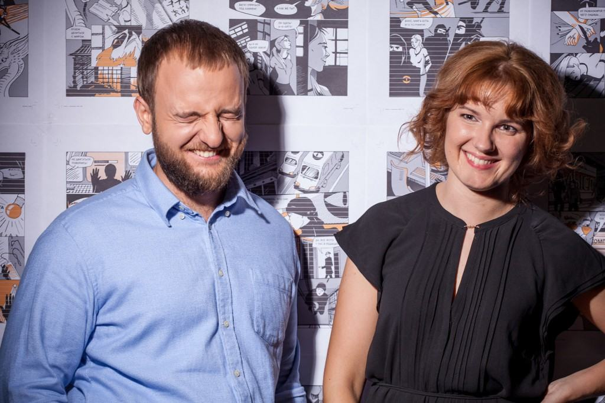

# Редактура на уровне слов. Инфостиль и стоп-слова

Инфостиль — это редакторская практика, изобретённая и пропагандируемая Максимом Ильяховым из Бюро Горбунова. Инфостиль популярен среди модных копирайтеров, продажников и дизайнеров.

Идеи инфостиля не новы. Они озвучены и иностранными авторами (The Elements of Style, On Writing Well), и отечественными («Слово живое и мёртвое»). Но Ильяхову лучше всех удалось систематизировать знания и подкрепить их примерами.

Весь инфостиль нам как техписателя не нужен. В курсе Ильяхова большая часть времени посвящена тексту «в мире клиента», что подразумевает наличие клиента — покупателя или заказчика. У техдокументации клиента обычно нет.

В инфостиле нас в первую очередь интересует методология, а именно приёмы редактуры. Первый такой приём — **стоп-слова**. В англоязычной литературе их называют weasel words.

Мозг ленив, и при чтении предложения стремится «срезать углы», пропуская слова, которые не влияют на смысл. Метод стоп-слов заключается в том, чтобы помочь мозгу читателя и выкинуть лишние слова заранее. Слова, которые мы подозреваем в ненужности, и называются стоп-словами. Когда вам попадается стоп-слово, нужно остановиться и подумать; бездумно удалять их нельзя!

!!! tip
    То, что мозг ленив, эволюционно оправданно. Внимание — ограниченный ресурс, и тратить его на бесполезные вещи опасно: в нужный момент внимания может не остаться.

Составить исчерпывающий список стоп-слов невозможно и не нужно. Зато можно составить список их категорий.

## Категории стоп-слов

| Мутные         | Лишние                   | Глупые     | Сложные                      |
|----------------|--------------------------|------------|------------------------------|
| усилители      | паразиты времени и места | штампы     | отглагольные существительные |
| оценки         | вводные конструкции      | междометия | модальные конструкции        |
| неопределённые | местоимения              |            | родительный падеж            |
|                | «успешно»                |            | обороты                      |                                    

### Мутные

**Усилители** — это слова, призванные усилять другие слова: «очень», «самый», «наиболее». Они плохи тем, что на самом деле не усливают, а ослабляют текст. «Я тебя люблю» сильнее, чем «я тебя очень сильно люблю». Усилить текст можно только смыслом.

**Оценки** — это субъективные определения: «красивый», «быстрый», «мощный». Они плохи, когда не подкреплены фактами. Моё «дорого» совсем не такое, как у моего соседа.

**Неопределённые формулировки** — это «какой-то», «примерно», «почти», «более». Они размывают точные данные, дают ложное чувство безопасности. Ложное, потому что ленивый мозг пропустит это слово, а не ленивый — обратит внимание и учует подвох. Люди натренированы замечать «от» в рекламных ценниках.

### Лишние

**Паразиты времени и места**: «на сегодняшний день», «сейчас», «на этом сайте». По умолчанию всё, что вы пишете, происходит здесь и сейчас, поэтому такие уточнения имеют ценность только в противопоставлениях: «вчера было так, а сегодня — так», «на том сайте то-то, а не этом — то-то».

**Вводные конструкции** — это «например», «кстати». Без них не обойтись в устной речи, потому что они помогают структурировать поток речи. На письме структура строится другими средствами.

**Местоимения**: «вы», «ваш», «мы». Конечно, без простых местоимений иногда не обойтись, но вот притяжательные почти наверняка не нужны: «вы можете пополнить свой счёт» — это то же самое, что «можете пополнить счёт». С местоимениями есть такой приём: если без них перестало читаться, в предложении слишком много действиущих лиц.

!!! important
    В английском языке местоимения употребляются намного чаще, в русском. Применяя правила, не забывайте делать поправку на ситауцию.

**Синонимы**. В школе учат, что надо использовать синонимы, чтобы разнообразить текст. Если в начале предложения был «ребёнок», в конце он должен стать «чадом», а в следующем предложении — «карапузом». Так вот, нет. Синонимы добавляют сложности, но не дают взамен полезной информации, поэтому относятся к стоп-словам.

Избегайте синонимов в однородных членах предложения. «Дорогая, роскошая машина» — это «дорогая машина» или «роскошная машина». «Файл качается, байтики бегут» — «файл качается» или «байтики бегут».

**«Успешно»** в выражениях «установка успешно завершена». «Завершена» уже значит успешно.

### Глупые

**Штамп** — это избитая фраза. Она уже толком ничего не значит, только занимает место. Бывают газетные штампы: «семимильными шагами», «сильные мира сего». Бывают корпоративные: «команда профессионалов», «под ключ». Штампы — отличительная черта провинциальных газет.

**Междометия**. «Ах», «ох», «лол», «кек». Междометие — чистая эмоция, и большинству статей не подходит по стилю. Междометия используют для заигрывания с читателем, а это сложно сделать так, чтобы не получился дурной тон.

### Сложные

**Отглагольные существительные**: «осуществить ремонт», «произвести посадку деревьев». Верные слуги канцелярита. Заменяются глаголами без потери смысла, зато с утратой официозного тона: «отремонтировать», «посадить деревья».

**Модальные конструкции**: «вы должны зарегистрироваться», «можно пройти тестирование», «можете оставить отзыв». В модальных конструкциях нет силы, они осторожны и бесхребетны. Императив или инфинитив наверняка будут лучше: «войдите», «пройти тест», «оставить отзыв».

**Родительный падеж**, связыающий больше двух слов, должен напрячь:

>   Увеличение длительности интервала повтора попыток подключения повысить шанс успешного подключения.
>  ↓ 
>   По умолчанию скрипт пробует подключиться в течение пяти секунд. При плохом интернете этого бывает мало. Чтобы увеличить длительность подключения, используйте флаг -d: ...

## Что писать вместо стоп-слов

После чистки от стоп-слов текст скорее всего будет скучным. Но не потому, что стоп-слова делали его интересным, а потому что они более не скрывают изначальной скучности.

Интересным текст делают не отдельные слова, а смысл. Именно его и стоить добавлять вместо стоп-слов. Вместо оценок — факты, вместо неопределённого — конкретное, вместо модальности — призыв к действию.

Подбирая факты, задумайтесь, что важно читателю. Если пишете README для библиотеки, полезно указать её размер, а если отчёт по разработке — затраченное время.

И не стесняйтесь округлять — бывает, что точное значение читателю не нужно:

>   Минифицированная версия весит 72 Кбайт, полная — тридцать мегабайтов

Первое число пишем точно, потому что, если уж читателю интересен минифицированный размер, он считает каждый килобайт. Второе число пишем округлённым, потому что это справочная информация — никто не будет использовать на сайте полную версию.

!!! tip
    Точные числа пишите цифрами, примерные — словами.

Если боитесь потерять смысл при округлении, есть два выхода:

-   привязать число к дате: «в 2018 году у нас было 2 201 894 клиента»
-   поставить счётчик

## Практика

Возьмите пример с сайта glvrd.ru и найдите в нём стоп-слова.
